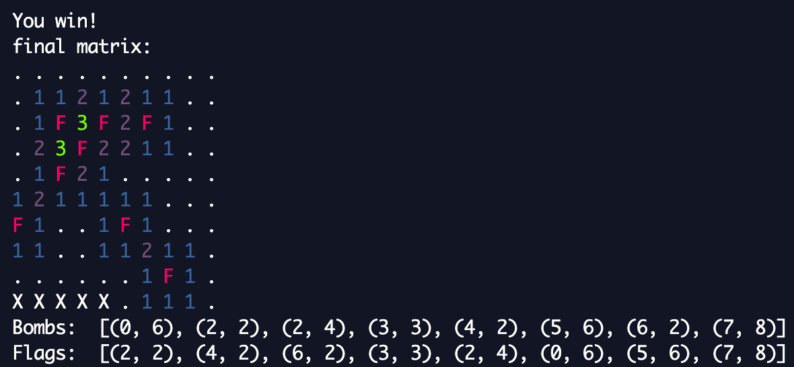

# Minesweeper Knowledge Based System Agent

## Description
Program ini adalah sebuah knowledge based system agent yang dapat memainkan Minesweeper. Agen dibuat menggunakan bahasa pemrograman CLIPS dan menggunakan program python sebagai penghubung dengan user melalui user input dan interface. 

User input dapat dimasukkan melalui file init.txt yang berisi ukuran papan, jumlah bom, dan posisi bom-bom tersebut. Program python akan mengolah input tersebut menjadi fakta-fakta permainan sebagai pengetahuan dasar agen. Selanjutnya, agen akan memainkan Minesweeper sesuai dengan detail dari user dan progaram python akan menampilkan langkah-langkah yang diambil agen, serta mengembalikan posisi bom-bom menurut agen tersebut.

## Requirements 
1. Python 3
2. pip installer
3. CLIPS 6.3.0
4. clipspy-0.3.2

## How to run
1. Program ini menggunakan library clipsPY untuk penghubung antara CLIPS IDE dan Python serta library termcolor sebagai ANSI Color formatting untuk output di terminal. Apabila belum memiliki library ini, gunakan `pip3 install clipspy` dan `pip3 install termcolor` pada command prompt untuk menginstall. Pastikan pip sudah terinstall dan sudah terupdate dalam versi paling baru-
2. Masukkan fakta awal berupa ukuran board, jumlah bomb, dan posisi bomb dalam `init.txt` dengan contoh sebagai berikut:
```
10
8
0, 6
2, 2
2, 4
3, 3
4, 2
5, 6
6, 2
7, 8
```
Baris pertama adalah ukuran board, baris kedua adalah jumlah bomb, baris ketiga hingga akhir adalah posisi masing-masing bomb (x, y) dengan penulisan 'x, y'. Pada contoh diatas, ukuran board adalah 10, jumlah bomb adalah 8, posisi bomb ada di (0, 6), (2, 2), (2, 4), (3, 3), (4, 2), (5, 6), (6, 2), dan (7, 8). Pastikan tidak ada spasi setelah angka terakhir dalam baris. 

3. Jalankan program dengan `python3 minesweeper.py `
4. Program akan menggambarkan langkah-langkah yang dilakukan oleh agen dalam bentuk matriks serta di akhir akan memberikan prediksi posisi bomb dan kondisi akhir


## Output program

